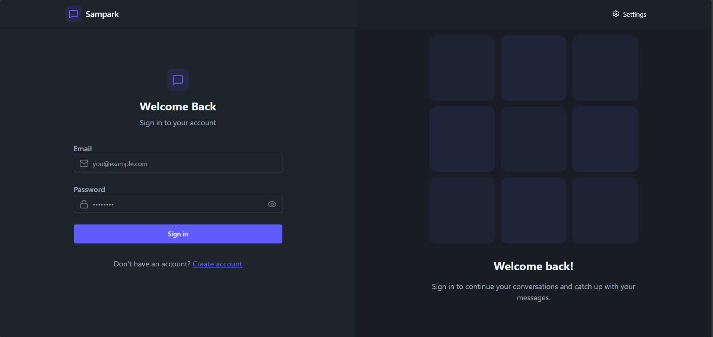

# ✨ Full Stack Realtime Chat App ✨

## 💬 Sampark

> **“Where people truly connect”**



---

## 🌐 Live Demo

🚀 **Sampark is live here:**  
👉 https://sampark-1.onrender.com/

---


## ✨ Highlights

- Tech stack: **MERN + Socket.io + TailwindCSS + DaisyUI**
- Authentication & Authorization with **JWT**
- **Real-time messaging** with Socket.io
- **Online user status**
- **Global state management** with Zustand
- **Error handling** on both server and client
- At the end **Deployment like a pro for FREE**
- And much more!

---

## ⚙️ Setup .env file

```env
PORT=5001
MONGO_URI=your_mongodb_uri
JWT_SECRET=your_jwt_secret

CLOUDINARY_CLOUD_NAME=your_cloud_name
CLOUDINARY_API_KEY=your_api_key
CLOUDINARY_API_SECRET=your_api_secret

NODE_ENV=development
```

---

## 🛠️ Build the app

```bash
npm run build
```

---

## ▶️ Start the app

```bash
npm start
```

---

⭐ If you like **Sampark**, don’t forget to star the repo!

> **Sampark – Where people truly connect**

